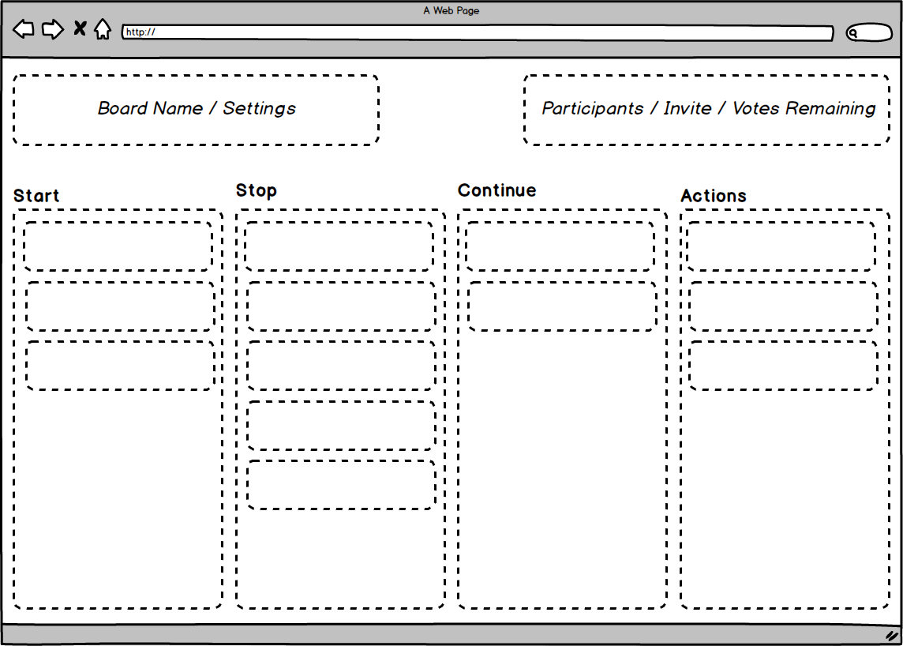
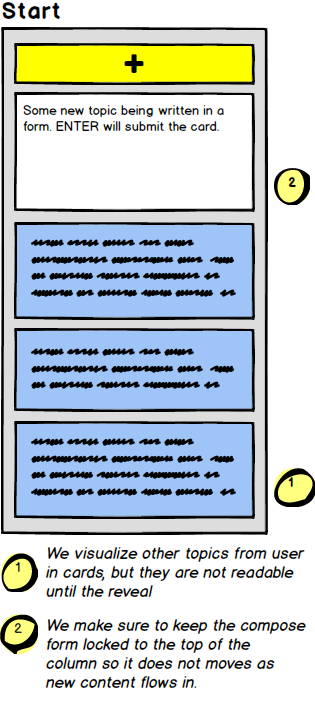
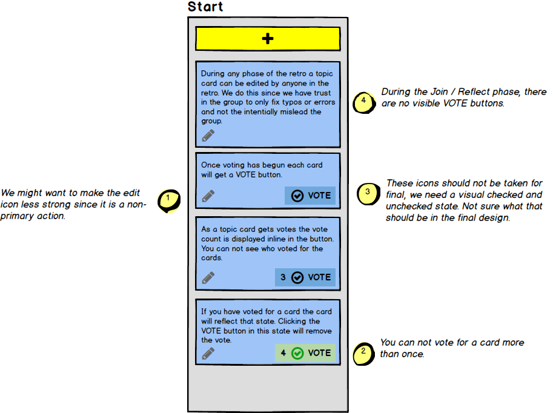

# Pitch: Feature Post and Vote

## Problem

A retrospective meeting is a regular practice of agile teams or any group of people who are looking for continued improvement to their team process, communication or habits. Successful retro meetings give the team an opportunity to reflect on what is working, what is not and what they want to do next. 

Retrospective meetings can be executed in many different ways but with the advent of more people working remotely having an online collaborative tool to help execute the meeting and capture feedback is often advantageous. Some people will initially lean on collaborative tools like Google Docs to help execute a retro meeting and while it can work, it is not very elegant or structured. There are also dedicated retro tools but most are locked behind account registration, paywalls or try to do too many things.

This project aims to provide a simple, focused tool to help people run a retro meeting online. Our solution will value:

* **A registrations-free experience** over formalized team management.
* **One-time use boards** over detailed historic archives.
* **Conversations** over analytical measurements or note taking.
* **A responsive web experience** over platform-specific apps.

This project will be released as open source, a member of the [Phoenix by Example](https://phoenixbyexample.com/) collection. The project will be hosted in a production like manner to encourage public use in addition to its educational aspirations.

## Appetite

The appetite for this pitch and the MVP of the product is 6 weeks of time, with approximately 10 hours of development per week.

## Solution

Our initial retro template will be a Start/Stop/Continue board, allowing people to document: things they want to start doing, things they want to stop doing, things they want to continue doing. During the discussion phase proposed actions to improve things will come up and those can be documented in the board as well.

Board Layout early concepts shows dedicated sections for: 

* Board Name / Settings
* Participants / Invite Link / Votes+Activity Indicators
* Four Columns: Start, Stop, Continue, Actions with buttons to add cards to each column.

The core behaviors for our retro board can be observed in the following story:

### Board Creation

A person visits the website and enters in a board name and their name. As the person creating the board they will be assigned the the facilitator role. The board will be created are they will be redirected to it.

### Join and Reflect Phase

From the Facilitator perspective they are presented with an invite link to copy and share. As people use the link and join the board they see their presence show up in the UI under Participants.

From a participant perspective upon opening the invite link, they are given the opportunity to join the board and must give their name to do so. As they join they see the board and can start posting content to the columns (Actions is visible but locked in this phase.). As they post content they can see visualizations of others typing and adding content but can not yet read the other people's content as it is masked during this first phase.

> **Why hide content?** We want to hide the content of the other participants during the initial phase to make sure one participant's notes do not influence the other participant's content.

Sample of compose form in column:

While an invitee can not witness the content being posted, the facilitator can. As content creation slows down they can manually group content together in advance to moving the reveal / voting phase.

> **Why allow grouping?** Grouping cards is a precursor to organizing the upcoming discussions. If people are documenting the same topic then votes to discuss that topic should not be split between topic cards. Only the facilitator can group cards together as it needs to be done very mindfully.

Once people are done adding topic cards the facilitator can hit a button to manually enter the reveal/voting phase. 

During this phase all of the other participant topics are revealed and the group can start voting for the topics they would like discussed. Each participant is given 6 votes and can vote for each topic card no more than once. If they voted for a card, the vote label will be visualized in a special way. If they want to cancel their vote then they can click the button to toggle the vote state.

While a participant can see vote totals, they can not see who voted for what or who wrote what.

> **Why 6 votes?** We are making an assumption there are 4-8 people in this meeting and to keep things simple we are just going with that number. Assuming that group size, and six votes per participant you should see some patterns in the expressed topics of interest.

Samples of the various UI state a card can be in:

Not visualized in the above, but possible: A topic card that has been merged.

As participants vote the UI should visualize how many votes they have remaining. In fact, it should be clear how many votes everyone has remaining so the group can tell when discussion should begin.

### Discussion / Action Phase

With votes tallied the group can then enter a discussion phase on the feedback. Some of these discussions can result in actions to take and anyone can add/edit cards to the the Actions column. Action cards, like topic cards can be edited / added by anyone. There is no voting for action cards.

> Aside: The Actions column will technically unlock when the board enters the reveal / vote phase though it is not expected to be used until people start discussing topics. We do this to keep the UI simple and not force the facilitator to move the board through a long series of phases.  

### Save / Print / Export

Since boards self destruct (need to make this clear in the UI, maybe in the footer?) after 60 days, all participants are encouraged to screenshot or otherwise print a copy for their archives.

### Notable Behaviors

* While we believe a facilitator should abstain from adding content to the board, we do not enforced any specific behavior blocking.
* We would like to take into consideration the readability of the board's URL. A pure UUID is not very readable. We may want to incorporate the board title into the URL. We may also want to lean on random words to help someone manually type in a board in a mobile device if they are reading it from a laptop Slack.
* Only a facilitator should be able to group cards. They can do so before the reveal / voting phase. If they group two cards with votes they should add up.
* We could simplify grouping with a simple String append with a newline and some dashes instead of building a complex model to track grouping.

## Rabbit Holes

We need to account for people reloading a web browser (after say a crash) and being able to rejoin and reacquire their facilitator privileges or participant votes without creating a second persona. We could include a `facilitator_password=123456` in the URL parameters or rely on cookies. To be determined.

We will not allow people to delete topic cards. They can edit it to a empty string but it can not be deleted for interface simplicity.

Drag and drop to do grouping while neat could be a rabbit hole and might need to be simplified to ship on time.

## No Gos

While it might be helpful to allow one facilitator to grant facilitator privileges to another participant, we will not be doing that in this cycle.

While it might be helpful to offer a sort option per column per vote count we will not be doing that in this cycle.

We will not display any formal timers during the retro. We leave it up the facilitator to manage the flow of the meeting.

We do not support any specific video/audio communications. It is assumed that all the participants can communicate with the others, either in-person or via separate online audio/video software.

While there are many different formats to running a retro we are specifically focusing on Start/Stop/Continue + Actions for this cycle.

While it might be neat to have an "assigned to" field for Actions, we will not be doing that in this cycle.

While it would be cool to offer more facilitator-specific tips and suggestions, we are not doing that in this cycle.
